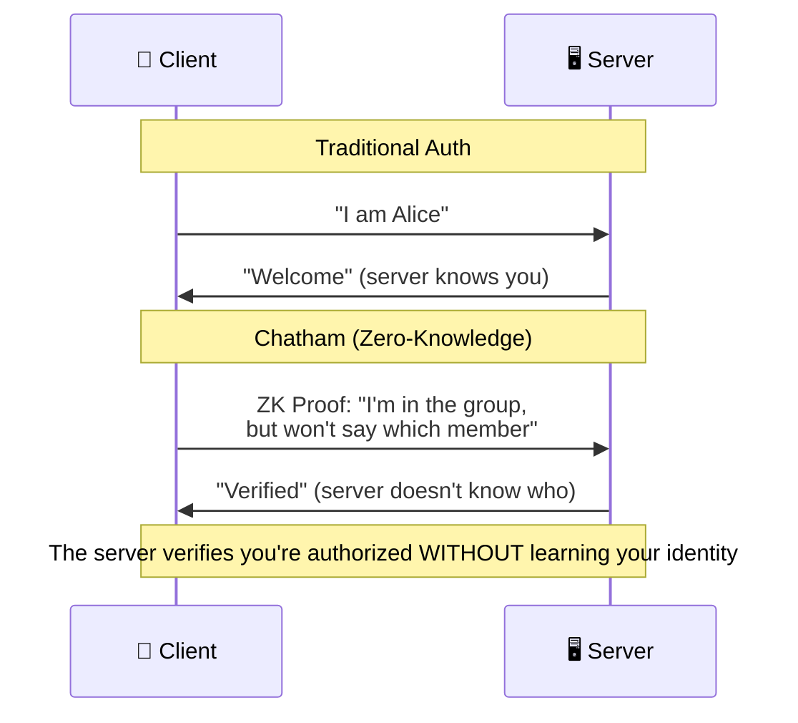
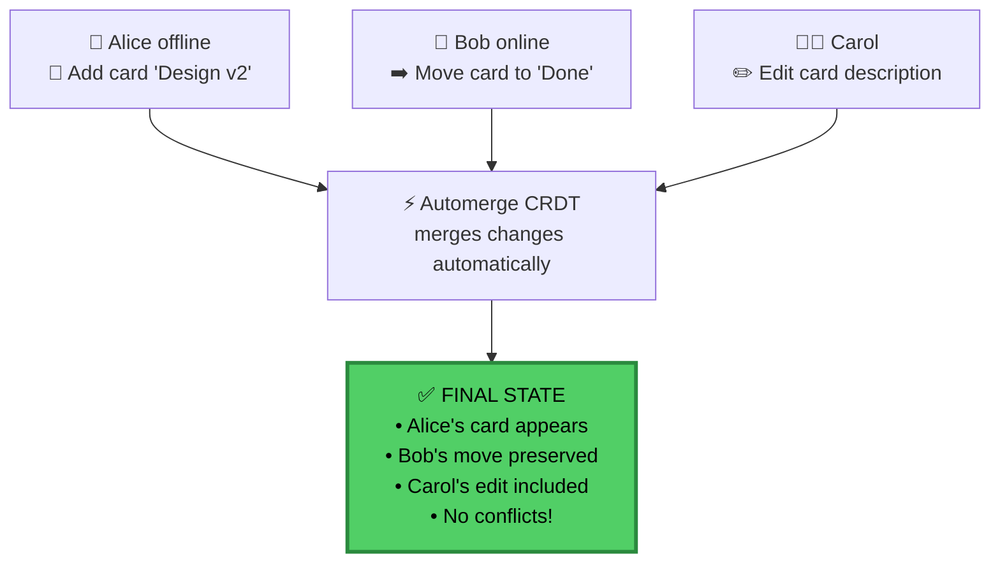

<p align="center">
  
  
  
</p>

<h1 align="center">Chatham</h1>
<h3 align="center">Privacy-First Project Management</h3>

<p align="center">
  <strong>Chatham House Rule for your projects.</strong><br/>
  We know you're a member — not what you do.
</p>

<p align="center">
  <a href="#-quick-start">Quick Start</a> •
  <a href="#-features">Features</a> •
  <a href="#-how-it-works">How It Works</a> •
  <a href="#️-the-chatham-house-model">Chatham House</a> •
  <a href="#-pricing">Pricing</a>
</p>

---

## The Problem

Traditional project management tools have full access to your data. Every card title, every comment, every file—visible to the vendor, vulnerable to breaches, subpoenable by courts.

**Your competitive strategy shouldn't live on someone else's server in plaintext.**

## The Solution

**Think: Chatham House Rule for project management.**

Just like in a Chatham House meeting, the server knows who's in the room — but can't see what's discussed or who said what. Your edits are anonymous, your content is encrypted, your activity is untraceable.

Under the hood: military-grade AES-256-GCM encryption and Semaphore ZK-SNARKs (Groth16 proofs).

<table>
<thead>
<tr>
<th colspan="3" align="center">🔍 WHAT THE SERVER SEES</th>
</tr>
</thead>
<tbody>
<tr>
<td colspan="3"><strong>Server knows:</strong><br/>✓ alice@company.com is a member of board xyz</td>
</tr>
<tr>
<td colspan="3"><strong>Server cannot see:</strong></td>
</tr>
<tr>
<td width="40%">❌ "Launch Q4 campaign"</td>
<td width="10%" align="center">→</td>
<td width="50%">✓ <code>0x8f3a...encrypted...4b2c</code></td>
</tr>
<tr>
<td>❌ "Budget: $50,000"</td>
<td align="center">→</td>
<td>✓ <code>[encrypted blob]</code></td>
</tr>
<tr>
<td>❌ File: strategy.pdf</td>
<td align="center">→</td>
<td>✓ <code>[encrypted R2 object]</code></td>
</tr>
<tr>
<td>❌ "Alice edited card #3"</td>
<td align="center">→</td>
<td>✓ <code>ZK proof (valid member)</code></td>
</tr>
</tbody>
</table>

---

## ✨ Features

<table>
<tr>
<td width="50%">

### 🔐 True End-to-End Encryption
Every card, comment, and attachment encrypted with **AES-256-GCM** before leaving your browser. Keys derived from your recovery phrase never touch our servers.

</td>
<td width="50%">

### 👻 Chatham House Collaboration
We know you're in the room — not what you say or do. **Zero-knowledge proofs** make your activity untraceable, even to us.

</td>
</tr>
<tr>
<td width="50%">

### ⚡ Real-time Sync
**Automerge CRDTs** enable conflict-free collaboration. Work offline, sync when connected. No merge conflicts ever.

</td>
<td width="50%">

### 🔑 Your Keys, Your Data
**24-word recovery phrase** means you control your data. Export anytime. No vendor lock-in. We can't help you if you lose it—by design.

</td>
</tr>
</table>

---

## 🎯 How It Works

### The Security Model


### Zero-Knowledge Authentication



### Real-time Collaboration Flow



---

## 💰 Pricing

<table>
<tr>
<th width="50%">Free</th>
<th width="50%">Pro</th>
</tr>
<tr>
<td>

**Perfect for small teams**

- ✅ 3 boards
- ✅ 5 members per board
- ✅ 100MB storage
- ✅ Full E2EE
- ✅ ZK anonymous collaboration
- ✅ Real-time sync
- ✅ Offline support

**$0/month forever**

</td>
<td>

**For growing teams**

- ✅ **Unlimited** boards
- ✅ **Unlimited** members
- ✅ **10GB** storage
- ✅ Full E2EE
- ✅ ZK anonymous collaboration
- ✅ Real-time sync
- ✅ Offline support
- ✅ Calendar view
- ✅ Card templates
- ✅ Audit logs

**Contact for pricing**

</td>
</tr>
</table>

> **Upgrade when you need to:** Team grows past 5, need a 4th board, or hit 100MB storage.

---

## 🚀 Quick Start

### Install the Extension

1. Download from Chrome Web Store *(coming soon)*
2. Click the extension icon
3. Create your account with a recovery phrase

### Or Build from Source

```bash
# Clone the repository
git clone https://github.com/h4x0r/chatham.git
cd chatham

# Install dependencies
pnpm install

# Build the extension
pnpm build
cd chatham-pro/apps/extension
pnpm build

# Load in Chrome
# 1. Go to chrome://extensions
# 2. Enable "Developer mode"
# 3. Click "Load unpacked"
# 4. Select the dist/ folder
```

---

## 📦 Open Source Packages

The cryptographic foundation is **MIT licensed** and fully auditable:

| Package | Description | NPM |
|---------|-------------|-----|
| **[@chatham/crypto](packages/crypto)** | E2EE primitives: BIP-39 phrases, AES-256-GCM, X25519 ECDH | [](https://npmjs.com/package/@chatham/crypto) |
| **[@chatham/semaphore](packages/semaphore)** | Semaphore ZK proof generation & verification | [](https://npmjs.com/package/@chatham/semaphore) |
| **[@chatham/automerge](packages/automerge)** | CRDT operations for kanban boards | [](https://npmjs.com/package/@chatham/automerge) |
| **[@chatham/storage](packages/storage)** | IndexedDB persistence layer | [](https://npmjs.com/package/@chatham/storage) |
| **[@chatham/types](packages/types)** | TypeScript definitions | [](https://npmjs.com/package/@chatham/types) |

### Code Examples

<details>
<summary><strong>Generate Recovery Phrase & Derive Keys</strong></summary>

```typescript
import { generatePhrase, phraseToSeed } from '@chatham/crypto'
import { deriveKeyPair } from '@chatham/crypto'

// Generate a new 24-word recovery phrase
const phrase = generatePhrase()
// "abandon ability able about above absent absorb abstract..."

// Derive cryptographic keys from the phrase
const seed = await phraseToSeed(phrase)
const { publicKey, privateKey } = await deriveKeyPair(seed)
```

</details>

<details>
<summary><strong>Encrypt & Decrypt Data</strong></summary>

```typescript
import { generateKey, encrypt, decrypt, exportKey, importKey } from '@chatham/crypto'

// Generate a board encryption key
const boardKey = await generateKey()

// Encrypt sensitive data
const plaintext = new TextEncoder().encode('Secret project details')
const ciphertext = await encrypt(boardKey, plaintext)

// Later, decrypt
const decrypted = await decrypt(boardKey, ciphertext)
const text = new TextDecoder().decode(decrypted)
// "Secret project details"
```

</details>

<details>
<summary><strong>Generate Zero-Knowledge Membership Proof</strong></summary>

```typescript
import { identityFromSeed, createGroup, addMember, generateProof, verifyProof } from '@chatham/semaphore'

// Create ZK identity from your seed
const identity = await identityFromSeed(seed)

// Board owner creates a group and adds members
const group = createGroup()
addMember(group, identity.commitment)
addMember(group, otherMember.commitment)

// Prove you're in the group WITHOUT revealing which member you are
const proof = await generateProof(
  identity,
  group,
  boardId,  // external nullifier
  Date.now() // message (for uniqueness)
)

// Server verifies the proof
const isValid = await verifyProof(proof, group.root)
// true - but server doesn't know WHO you are
```

</details>

---

## 🧪 Test Coverage

**303 tests passing**

<table>
<thead>
<tr>
<th>Package</th>
<th align="center">Tests</th>
<th>Coverage</th>
</tr>
</thead>
<tbody>
<tr>
<td><code>@chatham/crypto</code></td>
<td align="center">24</td>
<td>Phrase, AES, X25519</td>
</tr>
<tr>
<td><code>@chatham/storage</code></td>
<td align="center">10</td>
<td>IndexedDB operations</td>
</tr>
<tr>
<td><code>@chatham/semaphore</code></td>
<td align="center">24</td>
<td>Identity, Group, Proof</td>
</tr>
<tr>
<td><code>@chatham/automerge</code></td>
<td align="center">31</td>
<td>Schema, Operations</td>
</tr>
<tr>
<td><code>chatham-api</code></td>
<td align="center">65</td>
<td>Routes, Middleware, DO</td>
</tr>
<tr>
<td><code>chatham-extension</code></td>
<td align="center">130</td>
<td>Components, State, API</td>
</tr>
<tr>
<td><code>E2E (Playwright)</code></td>
<td align="center">19</td>
<td>Auth, Navigation, A11y</td>
</tr>
</tbody>
</table>

---

## 📚 Documentation

| Document | Description |
|----------|-------------|
| [Product Requirements](docs/PRD.md) | Full product specification |
| [Freemium Model](docs/FREEMIUM.md) | Business model details |
| [ADR-001: E2EE](docs/adr/001-e2ee-recovery-phrase.md) | Why BIP-39 + AES-256-GCM |
| [ADR-002: ZK Proofs](docs/adr/002-semaphore-zk-proofs.md) | Why Semaphore for anonymity |
| [ADR-003: CRDTs](docs/adr/003-automerge-crdt.md) | Why Automerge for sync |
| [ADR-004: Infrastructure](docs/adr/004-cloudflare-infrastructure.md) | Why Cloudflare edge |
| [ADR-005: Licensing](docs/adr/005-dual-licensing.md) | Open core model |
| [ADR-006: Decoupled Identity](docs/adr/006-decoupled-identity-architecture.md) | Email ≠ Boards privacy |

---

## 👁️ The Chatham House Model

**We know you're a paying customer. We cannot know which boards you're in.**

Chatham uses a **decoupled identity architecture** that separates billing from board operations:


### What The Server Knows

| Email Domain | Commitment Domain |
|--------------|-------------------|
| ✅ Your email | ✅ Board exists |
| ✅ Your tier | ✅ Commitment owns N boards |
| ✅ That you funded a commitment | ✅ Encrypted content |
| ❌ **Which** commitment | ❌ **Whose** commitment |

### What The Server Cannot Link

The server sees two separate facts:
1. `"alice@example.com is a Pro customer"`
2. `"Commitment 0x1a2b owns 3 boards"`

**The server cannot link these facts.** Only your device knows that alice's commitment is 0x1a2b.

### What Other Board Members See

| Data | Visibility | Why |
|------|------------|-----|
| Your display name | ✅ Visible | You choose it per-board |
| Your avatar color | ✅ Visible | For visual identification |
| Your edits & comments | ✅ Visible | Collaboration requires it |
| Your email | ❌ Hidden | Server doesn't even know |
| Your other boards | ❌ Hidden | Completely separate |

### True Chatham House

Unlike traditional apps, we don't just hide *what* you say — we hide *which rooms you're in*:

<table>
<tr>
<th width="50%">❌ Traditional Apps</th>
<th width="50%">✅ Chatham</th>
</tr>
<tr>
<td valign="top">
Server knows:<br/><br/>
• alice@... is in boards X, Y, Z<br/>
• alice@... edited card #123<br/>
• alice@... uploaded file.pdf<br/>
• Complete activity timeline
</td>
<td valign="top">
Server knows:<br/><br/>
• alice@... is a customer<br/>
• "some commitment" has boards<br/>
• "valid member" edited<br/>
• <strong>Cannot link activity to identity</strong>
</td>
</tr>
</table>

**Bottom line:** We know you exist. We cannot know what you do.

---

## 🔒 Security

### What We Can't Do

- ❌ Read your board contents (encrypted client-side)
- ❌ See what your team discusses (cards, comments, columns)
- ❌ Access your file contents (encrypted before upload)
- ❌ Know who made which specific edit (ZK proofs)
- ❌ Link your email to your boards (decoupled architecture)
- ❌ Reset your password (there is none)
- ❌ Recover your data without your phrase

### What We Can See

- ✅ Your email exists and has a tier (billing only)
- ✅ That boards exist (not whose)
- ✅ That commitments have quotas (not whose)

### What This Means

- ✅ **Content-proof**: Board content is unreadable to us
- ✅ **Membership-anonymous**: Can't link email to boards
- ✅ **Activity-anonymous**: Can't attribute edits to users
- ✅ **You're in control**: Your phrase = your data

### Threat Model

| Threat | Mitigation |
|--------|------------|
| Server compromise | All content encrypted; no email↔board link to steal |
| Man-in-the-middle | TLS + E2EE (double encryption) |
| Malicious insider | Server has no decryption keys, no linkage data |
| Legal compulsion | Can only provide email list; cannot identify board membership |
| Activity tracking | ZK proofs prevent attributing anything to users |

---

## 🤝 Contributing

We welcome contributions to the open-source packages! See [CONTRIBUTING.md](CONTRIBUTING.md) for guidelines.

**Security issues?** Email security@chatham.one (PGP key available)

---

## 📜 License

Dual Licensed: MIT + Commercial

- **This repository** (`chatham`): [MIT License](LICENSE)
  - Crypto packages (`packages/*`)
  - Local-only application features (UI, storage, encryption)

- **Cloud features** (private `chatham-pro` repository): **Proprietary** (NOT open source)
  - Cloud sync, collaboration, backend API
  - Commercial license required for production use
  - Free tier available: ≤5 users, ≤$1M revenue

See [ADR-005](docs/adr/005-dual-licensing.md) for details.

---

<p align="center">
  <strong>Stop trusting. Start verifying.</strong><br/>
  <sub>Built with 🔐 by privacy advocates, for privacy advocates.</sub>
</p>
