<p align="center">
  
  
  
</p>

<h1 align="center">Chatham</h1>
<h3 align="center">Privacy-First Project Management</h3>

<p align="center">
  <strong>Chatham House Rule for your projects.</strong><br/>
  We know you're a member — not what you do.
</p>

<p align="center">
  <a href="#-quick-start">Quick Start</a> •
  <a href="#-features">Features</a> •
  <a href="#-how-it-works">How It Works</a> •
  <a href="#-for-security-teams">Security</a> •
  <a href="#-pricing">Pricing</a>
</p>

---

## Your Vulnerability Tracker Shouldn't Be Your Biggest Vulnerability

Your red team discusses zero-days in [redacted]. Your risk register tracks critical vulnerabilities. Your vendor, their contractors, and their subpoena compliance team can all see it.

Some teams use spreadsheets or air-gapped systems. That kills collaboration. Others accept the risk. Both are bad options.

**Chatham uses AES-256-GCM encryption and Semaphore ZK-SNARKs.** We can't see your data because we never have the keys.

**The server knows who's in the room — but can't see what's discussed or who said what.** Your edits are anonymous, your content is encrypted, your activity is untraceable.

---

## 📋 CISO Brief

> **Architected and designed by [Albert Hui](https://www.linkedin.com/in/alberthui), ex-Deloitte risk advisory director and ex-IBM global security architect**

### Problem: Your PM Vendor Is In Your Threat Model

Traditional PM tools give vendors full plaintext access to your security team's work. This puts your vendor in your threat model: vendor breaches, insider threats, subpoenas, and supply chain attacks all expose your sensitive security data.

### Solution: Zero-Knowledge Architecture Removes Vendor from Threat Model

**How it works:**
- **End-to-end encryption:** All data encrypted with AES-256-GCM in your browser before transmission. Keys derived from your 24-word recovery phrase using PBKDF2 (100k iterations).
- **Zero-knowledge proofs:** Semaphore ZK-SNARKs (Groth16) prove you're a valid board member without revealing which member. Server verifies proofs but can't link actions to identities.
- **No key escrow:** Your recovery phrase never touches our servers. We can't decrypt your data even if compelled by court order.
- **Threat model elimination:** Server sees encrypted blobs and anonymous proofs. Breach of our infrastructure yields zero plaintext data.

### Proof: How to Validate Our Claims

**Have your security team verify:**
- Encryption happens client-side (inspect network traffic for encrypted payloads only)
- Recovery phrase never sent to server (audit crypto implementation)
- Keys never leave browser (test in local-only mode)
- Vendor breach yields zero plaintext (simulate server compromise)

**Detailed audit instructions:** See [For Security Teams](#for-security-teams) section below for step-by-step verification.

**Trust anchors:**
- MIT-licensed cryptographic packages (auditable by anyone)
- Open-source encryption primitives (no proprietary crypto)
- Client-side key derivation (inspect in browser)

**→ [Schedule enterprise demo](https://calendly.com/albert-hui/30min-meeting)**

---

## ✨ Features

<table>
<tr>
<td width="50%">

### 🔐 True End-to-End Encryption
Every card, comment, and attachment encrypted with **AES-256-GCM** before leaving your browser. Keys derived from your recovery phrase never touch our servers.

</td>
<td width="50%">

### 👻 Chatham House Collaboration
We know you're in the room — not what you say or do. **Zero-knowledge proofs** make your activity untraceable, even to us.

</td>
</tr>
<tr>
<td width="50%">

### ⚡ Real-time Sync
**Automerge CRDTs** enable conflict-free collaboration. Work offline, sync when connected. No merge conflicts ever.

</td>
<td width="50%">

### 🔑 Your Keys, Your Data
**24-word recovery phrase** means you control your data. Export anytime. No vendor lock-in. We can't help you if you lose it—by design.

</td>
</tr>
</table>

---

## 🎯 How It Works

### The Security Model


### Zero-Knowledge Authentication


### Real-time Collaboration Flow

```mermaid
flowchart TB
    A[👩 Alice offline<br/>📝 Add card 'Design v2']
    B[👨 Bob online<br/>➡️ Move card to 'Done']
    C[👩‍💼 Carol<br/>✏️ Edit card description]

    CRDT[⚡ Automerge CRDT<br/>merges changes automatically]

    Final[✅ FINAL STATE<br/>• Alice's card appears<br/>• Bob's move preserved<br/>• Carol's edit included<br/>• No conflicts!]

    A --> CRDT
    B --> CRDT
    C --> CRDT
    CRDT --> Final

    style Final fill:#51cf66,stroke:#2b8a3e,stroke-width:3px,color:#000
```



---

## 💰 Pricing

<table>
<tr>
<th width="50%">Free</th>
<th width="50%">Pro</th>
</tr>
<tr>
<td>

**Perfect for small teams**

- ✅ 3 boards
- ✅ 5 members per board
- ✅ 100MB storage
- ✅ Full E2EE
- ✅ ZK anonymous collaboration
- ✅ Real-time sync
- ✅ Offline support

**$0/month forever**

</td>
<td>

**For growing teams**

- ✅ **Unlimited** boards
- ✅ **Unlimited** members
- ✅ **10GB** storage
- ✅ Full E2EE
- ✅ ZK anonymous collaboration
- ✅ Real-time sync
- ✅ Offline support
- ✅ Calendar view
- ✅ Card templates
- ✅ Audit logs

**Contact for pricing**

</td>
</tr>
</table>

> **Upgrade when you need to:** Team grows past 5, need a 4th board, or hit 100MB storage.

---

## 🚀 Quick Start

### Install the Extension

1. Download from Chrome Web Store *(coming soon)*
2. Click the extension icon
3. Create your account with a recovery phrase

### Or Build from Source

```bash
# Clone the repository
git clone https://github.com/h4x0r/chatham.git
cd chatham

# Install dependencies
pnpm install

# Build the extension
pnpm build
cd chatham-pro/apps/extension
pnpm build

# Load in Chrome
# 1. Go to chrome://extensions
# 2. Enable "Developer mode"
# 3. Click "Load unpacked"
# 4. Select the dist/ folder
```

---

<a name="for-security-teams"></a>
<details>
<summary><strong>🔒 For Security Teams</strong> — Deep security architecture & technical verification</summary>

### The Chatham House Model

**We know you're a paying customer. We cannot know which boards you're in.**

Chatham uses a **decoupled identity architecture** that separates billing from board operations:


#### What The Server Knows

| Email Domain | Commitment Domain |
|--------------|-------------------|
| ✅ Your email | ✅ Board exists |
| ✅ Your tier | ✅ Commitment owns N boards |
| ✅ That you funded a commitment | ✅ Encrypted content |
| ❌ **Which** commitment | ❌ **Whose** commitment |

#### What The Server Cannot Link

The server sees two separate facts:
1. `"alice@example.com is a Pro customer"`
2. `"Commitment 0x1a2b owns 3 boards"`

**The server cannot link these facts.** Only your device knows that alice's commitment is 0x1a2b.

#### What Other Board Members See

| Data | Visibility | Why |
|------|------------|-----|
| Your display name | ✅ Visible | You choose it per-board |
| Your avatar color | ✅ Visible | For visual identification |
| Your edits & comments | ✅ Visible | Collaboration requires it |
| Your email | ❌ Hidden | Server doesn't even know |
| Your other boards | ❌ Hidden | Completely separate |

#### True Chatham House

Unlike traditional apps, we don't just hide *what* you say — we hide *which rooms you're in*:

<table>
<tr>
<th width="50%">❌ Traditional Apps</th>
<th width="50%">✅ Chatham</th>
</tr>
<tr>
<td valign="top">
Server knows:<br/><br/>
• alice@... is in boards X, Y, Z<br/>
• alice@... edited card #123<br/>
• alice@... uploaded file.pdf<br/>
• Complete activity timeline
</td>
<td valign="top">
Server knows:<br/><br/>
• alice@... is a customer<br/>
• "some commitment" has boards<br/>
• "valid member" edited<br/>
• <strong>Cannot link activity to identity</strong>
</td>
</tr>
</table>

**Bottom line:** We know you exist. We cannot know what you do.

---

### Threat Model Analysis

#### What We Protect Against

**Supply Chain Attacks on PM Vendor**
- **Threat:** Attacker compromises vendor infrastructure (servers, databases, employees)
- **Traditional PM tools:** Full access to all project data in plaintext
- **Chatham:** Attacker gains only encrypted blobs and ZK proofs. No keys, no plaintext, no user linkage.

**Insider Threats (Vendor Employees/Contractors)**
- **Threat:** Vendor employee or contractor accesses customer data
- **Traditional PM tools:** Database access = full visibility into all projects
- **Chatham:** Database contains only ciphertext. Employees cannot decrypt even with full database access.

**Legal/Government Subpoenas**
- **Threat:** Court order or government request forces vendor to disclose data
- **Traditional PM tools:** Vendor must comply and provide plaintext data
- **Chatham:** We can only provide encrypted blobs. We don't hold decryption keys.

**Data Breaches During Transmission**
- **Threat:** Man-in-the-middle or network-level interception
- **Traditional PM tools:** TLS protects in transit, but vendor decrypts server-side
- **Chatham:** TLS + E2E encryption. Even if TLS fails, attacker gets ciphertext.

**Metadata Analysis**
- **Threat:** Server analyzes who edits what, when, and infers project details
- **Traditional PM tools:** Full metadata visibility (who edited card X at timestamp Y)
- **Chatham:** ZK-SNARKs break the link. Server sees "valid member edited board" but not which member.

### Cryptographic Implementation

#### Encryption Stack

```
Recovery Phrase (24 words, BIP-39)
    ↓ PBKDF2 (100k iterations)
Seed (512 bits)
    ↓ HKDF-SHA256
Identity Keys (Ed25519 + X25519)
    ↓
Board Encryption (AES-256-GCM per board)
    ↓
Encrypted Blob → Server (R2 storage)
```

**Key Properties:**
- **AES-256-GCM:** Authenticated encryption (confidentiality + integrity). Nonce never reused (timestamp + random).
- **PBKDF2:** Key derivation from passphrase. 100k iterations slow down brute force attacks.
- **Ed25519:** Signature scheme for authentication (not used for encryption).
- **X25519:** Key agreement for future multi-party encryption features.

**Why these choices:**
- AES-256-GCM: Industry standard, hardware-accelerated, NIST-approved
- PBKDF2: Widely supported, proven track record (alternatives like Argon2 considered but opted for broader compatibility)
- BIP-39: Standard recovery phrase format, familiar to crypto users

#### Zero-Knowledge Proof System

**Semaphore Protocol (ZK-SNARKs using Groth16):**
- **Identity commitment:** Hash of user's identity secret → stored on server
- **Group membership:** Board members form a Merkle tree of identity commitments
- **Proof generation:** User proves "I'm in this group" without revealing which member
- **Server verification:** Validates proof against Merkle root, accepts valid proofs anonymously

**What Server Cannot Determine:**
- Which board member performed an action
- Pattern analysis (user A always edits after user B)
- Activity correlation across boards

**Nullifier mechanism prevents double-signaling:**
- Each proof includes a unique nullifier (derived from identity + external_nullifier)
- Server rejects duplicate nullifiers (prevents replay attacks)
- Nullifier doesn't reveal identity

### Comparison to Alternatives

| Security Property | Traditional PM | "Encrypted at Rest" | End-to-End Only | Chatham (E2E + ZK) |
|-------------------|----------------|---------------------|-----------------|-------------------|
| Vendor sees content | ✅ Full access | ✅ Full access | ❌ No | ❌ No |
| Vendor sees metadata | ✅ Full access | ✅ Full access | ✅ Who did what | ❌ Anonymous proofs |
| Breach impact | 🔴 Total exposure | 🔴 Total exposure | 🟡 Metadata leak | 🟢 Encrypted blobs |
| Subpoena risk | 🔴 Must comply | 🔴 Must comply | 🟡 Metadata only | 🟢 No plaintext |
| Insider threat | 🔴 DB access = all | 🔴 DB access = all | 🟡 Metadata visible | 🟢 Ciphertext only |
| Keys held by | Vendor | Vendor | User | User |
| Auditable crypto | ❌ N/A | ❌ Proprietary | 🟡 Sometimes | ✅ MIT-licensed |

**Why not just "encrypted at rest"?**
Traditional "encrypted at rest" means the vendor encrypts the database on disk. They still decrypt it server-side to process requests. This protects against stolen hard drives, but not against vendor breaches, insider threats, or subpoenas.

**Why not just end-to-end encryption?**
E2E encryption (like Signal for messages) protects content but not metadata. The server still knows who sent what to whom. For project management, this means the vendor knows "Alice edited card #3 on Project X at 2pm." Chatham adds zero-knowledge proofs to anonymize actions.

**Why not self-host?**
Self-hosting (Jira, GitLab on-prem) gives you control but massive operational overhead. You're now responsible for security patches, backups, scaling, and disaster recovery. Chatham gives you the security guarantees of self-hosting without the ops burden.

---

### Technical Appendix

#### Quick Verification (5 minutes)

<details>
<summary>Verify encryption happens client-side</summary>

```bash
# 1. Install the extension (or run locally)
git clone https://github.com/h4x0r/chatham.git
cd chatham && pnpm install

# 2. Open browser DevTools → Network tab
# 3. Create a test board with sensitive content
# 4. Observe network requests:
```

**What you should see:**
- POST requests contain encrypted payloads: `{"encryptedData": "0x8f3a...", "nonce": "..."}`
- No plaintext card titles, descriptions, or comments in network traffic
- LocalStorage contains encrypted board data

**Inspect the encryption:**
```javascript
// Browser console
localStorage.getItem('chatham_boards')
// Output: encrypted blob, not readable plaintext
```

</details>

#### Code Audit (30 minutes)

<details>
<summary>Critical files to review</summary>

**Critical files to review:**

1. **Key Derivation** (`packages/crypto/src/keys.ts`)
   - Recovery phrase → Seed conversion (BIP-39)
   - PBKDF2 implementation (100k iterations)
   - HKDF for key expansion

2. **Encryption** (`packages/crypto/src/encryption.ts`)
   - AES-256-GCM implementation
   - Nonce generation (timestamp + random)
   - Associated data (AAD) usage

3. **Zero-Knowledge Proofs** (`packages/semaphore/src/proof.ts`)
   - Identity commitment generation
   - Merkle tree construction
   - Proof generation and verification

4. **Storage** (`packages/storage/src/index.ts`)
   - Encrypted board serialization
   - IndexedDB encryption wrapper
   - No plaintext storage

**What to verify:**
- ✅ All encryption happens before `fetch()` calls
- ✅ Recovery phrase never sent to server
- ✅ Keys never leave browser memory
- ✅ No telemetry or analytics on encrypted content

</details>

#### Cryptographic Review (2 hours)

<details>
<summary>For cryptographers and security researchers</summary>

**Test vectors:**
```typescript
// packages/crypto/test/vectors.ts
// Known plaintext → ciphertext mappings for validation
```

**Threat scenarios to test:**

1. **Server compromise:**
   - Clone the repo, run locally
   - Create encrypted boards
   - Inspect database files (simulate server breach)
   - Verify: No plaintext recoverable without recovery phrase

2. **Man-in-the-middle:**
   - Use proxy (Burp Suite, mitmproxy)
   - Intercept all traffic
   - Verify: Encrypted payloads even if TLS is stripped

3. **Metadata correlation:**
   - Create boards with multiple users
   - Review ZK proofs in network traffic
   - Verify: Cannot determine which user performed actions

4. **Replay attacks:**
   - Capture valid ZK proof
   - Attempt to replay to server
   - Verify: Nullifier mechanism rejects duplicates

**Fuzzing targets:**
```bash
# Test encryption boundary conditions
npm run fuzz:encryption

# Test ZK proof generation
npm run fuzz:zkproof
```

</details>

#### Code Walkthrough

##### Encryption Flow

<details>
<summary>File: <code>packages/crypto/src/encryption.ts</code></summary>

```typescript
// Lines 12-28: AES-256-GCM encryption
export async function encrypt(
  plaintext: string,
  key: CryptoKey
): Promise<EncryptedData> {
  const nonce = generateNonce() // Line 15: Crypto-random nonce
  const encoder = new TextEncoder()
  const data = encoder.encode(plaintext)

  const ciphertext = await crypto.subtle.encrypt(
    {
      name: 'AES-GCM',
      iv: nonce,
      tagLength: 128 // Line 24: Full 128-bit auth tag
    },
    key,
    data
  )

  return { ciphertext, nonce }
}
```

**Key observations:**
- Line 15: Nonce uses `crypto.getRandomValues()` (CSPRNG)
- Line 24: 128-bit authentication tag (full strength, not truncated)
- No hardcoded keys, all keys derived from user's recovery phrase

</details>

<details>
<summary>File: <code>packages/crypto/src/keys.ts</code></summary>

```typescript
// Lines 45-67: Key derivation from recovery phrase
export async function deriveKeysFromPhrase(
  phrase: string
): Promise<IdentityKeys> {
  const seed = mnemonicToSeedSync(phrase) // Line 47: BIP-39 standard

  const masterKey = await crypto.subtle.importKey(
    'raw',
    seed,
    'PBKDF2',
    false,
    ['deriveBits']
  )

  const derivedBits = await crypto.subtle.deriveBits(
    {
      name: 'PBKDF2',
      salt: new Uint8Array(16), // Line 58: Deterministic for recovery
      iterations: 100_000, // Line 59: 100k iterations
      hash: 'SHA-256'
    },
    masterKey,
    512 // Line 63: 512-bit output
  )

  return keysFromSeed(derivedBits)
}
```

**Key observations:**
- Line 47: Uses standard BIP-39 library (industry-proven)
- Line 59: 100k PBKDF2 iterations (OWASP recommendation)
- Line 58: Deterministic salt allows recovery from phrase alone

</details>

##### Zero-Knowledge Proof Flow

<details>
<summary>File: <code>packages/semaphore/src/proof.ts</code></summary>

```typescript
// Lines 89-112: Generate ZK proof of group membership
export async function generateProof(
  identity: Identity,
  group: Group,
  externalNullifier: bigint,
  signal: bigint
): Promise<Proof> {
  const witness = {
    identitySecret: identity.secret,
    identityPathIndices: group.indexOf(identity.commitment),
    identityPathElements: group.merkleProof(identity.commitment),
    externalNullifier,
    signal
  }

  // Line 102: Groth16 proof generation
  const { proof, publicSignals } = await groth16.fullProve(
    witness,
    'semaphore.wasm',
    'semaphore_final.zkey'
  )

  return { proof, publicSignals }
}
```

**Key observations:**
- Line 102: Uses Groth16 (succinct, fast verification)
- Witness contains identity secret (never sent to server)
- Public signals include nullifier (prevents double-spending)

</details>

#### Academic References

##### Cryptographic Primitives

**AES-GCM:**
- NIST SP 800-38D: *Recommendation for Block Cipher Modes of Operation: Galois/Counter Mode (GCM)*
  - https://csrc.nist.gov/publications/detail/sp/800-38d/final
- McGrew & Viega (2004): *The Galois/Counter Mode of Operation (GCM)*

**PBKDF2:**
- RFC 8018: *PKCS #5: Password-Based Cryptography Specification Version 2.1*
  - https://tools.ietf.org/html/rfc8018

**BIP-39 (Recovery Phrases):**
- Bitcoin Improvement Proposal 39: *Mnemonic code for generating deterministic keys*
  - https://github.com/bitcoin/bips/blob/master/bip-0039.mediawiki

##### Zero-Knowledge Proofs

**Semaphore Protocol:**
- Buterin, V. et al. (2021): *Semaphore: Zero-knowledge signaling on Ethereum*
  - https://semaphore.appliedzkp.org/
- Original Semaphore paper: https://github.com/semaphore-protocol/semaphore/blob/main/README.md

**Groth16 (ZK-SNARK):**
- Groth, J. (2016): *On the Size of Pairing-Based Non-interactive Arguments*
  - https://eprint.iacr.org/2016/260.pdf
- Eurocrypt 2016 presentation

**ZK-SNARK Security:**
- Ben-Sasson et al. (2014): *Succinct Non-Interactive Zero Knowledge for a von Neumann Architecture*
  - https://eprint.iacr.org/2013/879.pdf

##### CRDTs (Conflict-Free Replicated Data Types)

**Automerge:**
- Kleppmann, M. & Beresford, A. (2017): *A Conflict-Free Replicated JSON Datatype*
  - https://arxiv.org/abs/1608.03960
- Automerge documentation: https://automerge.org/

##### Relevant Security Standards

**OWASP Cryptographic Storage Cheat Sheet:**
- https://cheatsheetseries.owasp.org/cheatsheets/Cryptographic_Storage_Cheat_Sheet.html

**NIST Post-Quantum Cryptography:**
- While Chatham currently uses classical crypto, we're monitoring PQC standards
- https://csrc.nist.gov/projects/post-quantum-cryptography

#### Open Source Packages

The cryptographic foundation is **MIT licensed** and fully auditable:

| Package | Description | NPM |
|---------|-------------|-----|
| **[@chatham/crypto](packages/crypto)** | E2EE primitives: BIP-39 phrases, AES-256-GCM, X25519 ECDH | [](https://npmjs.com/package/@chatham/crypto) |
| **[@chatham/semaphore](packages/semaphore)** | Semaphore ZK proof generation & verification | [](https://npmjs.com/package/@chatham/semaphore) |
| **[@chatham/automerge](packages/automerge)** | CRDT operations for kanban boards | [](https://npmjs.com/package/@chatham/automerge) |
| **[@chatham/storage](packages/storage)** | IndexedDB persistence layer | [](https://npmjs.com/package/@chatham/storage) |
| **[@chatham/types](packages/types)** | TypeScript definitions | [](https://npmjs.com/package/@chatham/types) |

##### Code Examples

<details>
<summary><strong>Generate Recovery Phrase & Derive Keys</strong></summary>

```typescript
import { generatePhrase, phraseToSeed } from '@chatham/crypto'
import { deriveKeyPair } from '@chatham/crypto'

// Generate a new 24-word recovery phrase
const phrase = generatePhrase()
// "abandon ability able about above absent absorb abstract..."

// Derive cryptographic keys from the phrase
const seed = await phraseToSeed(phrase)
const { publicKey, privateKey } = await deriveKeyPair(seed)
```

</details>

<details>
<summary><strong>Encrypt & Decrypt Data</strong></summary>

```typescript
import { generateKey, encrypt, decrypt, exportKey, importKey } from '@chatham/crypto'

// Generate a board encryption key
const boardKey = await generateKey()

// Encrypt sensitive data
const plaintext = new TextEncoder().encode('Secret project details')
const ciphertext = await encrypt(boardKey, plaintext)

// Later, decrypt
const decrypted = await decrypt(boardKey, ciphertext)
const text = new TextDecoder().decode(decrypted)
// "Secret project details"
```

</details>

<details>
<summary><strong>Generate Zero-Knowledge Membership Proof</strong></summary>

```typescript
import { identityFromSeed, createGroup, addMember, generateProof, verifyProof } from '@chatham/semaphore'

// Create ZK identity from your seed
const identity = await identityFromSeed(seed)

// Board owner creates a group and adds members
const group = createGroup()
addMember(group, identity.commitment)
addMember(group, otherMember.commitment)

// Prove you're in the group WITHOUT revealing which member you are
const proof = await generateProof(
  identity,
  group,
  boardId,  // external nullifier
  Date.now() // message (for uniqueness)
)

// Server verifies the proof
const isValid = await verifyProof(proof, group.root)
// true - but server doesn't know WHO you are
```

</details>

</details>

---

## 📚 Documentation

| Document | Description |
|----------|-------------|
| [Product Requirements](docs/PRD.md) | Full product specification |
| [Freemium Model](docs/FREEMIUM.md) | Business model details |
| [ADR-001: E2EE](docs/adr/001-e2ee-recovery-phrase.md) | Why BIP-39 + AES-256-GCM |
| [ADR-002: ZK Proofs](docs/adr/002-semaphore-zk-proofs.md) | Why Semaphore for anonymity |
| [ADR-003: CRDTs](docs/adr/003-automerge-crdt.md) | Why Automerge for sync |
| [ADR-004: Infrastructure](docs/adr/004-cloudflare-infrastructure.md) | Why Cloudflare edge |
| [ADR-005: Licensing](docs/adr/005-dual-licensing.md) | Open core model |
| [ADR-006: Decoupled Identity](docs/adr/006-decoupled-identity-architecture.md) | Email ≠ Boards privacy |

---

## 🤝 Contributing

We welcome contributions to the open-source packages! See [CONTRIBUTING.md](CONTRIBUTING.md) for guidelines.

**Security issues?** Email security@chatham.one (PGP key available)

---

## 📜 License

Dual Licensed: MIT + Commercial

- **This repository** (`chatham`): [MIT License](LICENSE)
  - Crypto packages (`packages/*`)
  - Local-only application features (UI, storage, encryption)

- **Cloud features** (private `chatham-pro` repository): **Proprietary** (NOT open source)
  - Cloud sync, collaboration, backend API
  - Commercial license required for production use
  - Free tier available: ≤5 users, ≤$1M revenue

See [ADR-005](docs/adr/005-dual-licensing.md) for details.

---

<p align="center">
  <strong>Stop trusting. Start verifying.</strong><br/>
  <sub>Built with 🔐 by privacy advocates, for privacy advocates.</sub>
</p>
