# Product Requirements Document: ZKKB

**Product Name**: ZKKB (Zero-Knowledge Kanban Board)
**Version**: 2.0
**Last Updated**: 2024-12-11
**Author**: ZKKB Team
**Status**: Accepted

---

## 1. Executive Summary

### 1.1 Problem Statement

Existing kanban tools (Trello, Notion, Jira) store user data unencrypted on their servers. This creates privacy risks:
- Service providers can read all board content
- Data breaches expose sensitive project information
- Compliance challenges for regulated industries
- No user control over data access
- Metadata reveals who collaborates with whom

### 1.2 Solution

ZKKB is an end-to-end encrypted kanban board implementing the **Chatham House Model**:

> "We know you're a paying customer. We cannot know which boards you're in or what you do there."

Key properties:
- All content encrypted client-side before transmission
- **Decoupled identity**: Email (billing) is separate from commitment (boards)
- Zero-knowledge proofs for all board operations — no session auth
- Server cannot link your email to your boards
- Real-time collaboration without compromising privacy

### 1.3 The Chatham House Model

Unlike traditional apps where the server knows everything, ZKKB separates identity into two unlinkable domains:

| Email Domain | Commitment Domain |
|--------------|-------------------|
| Authentication | Board operations |
| Billing/tier | Membership proofs |
| Storage quota | Board ownership |
| Server links: email ↔ tier | Server links: commitment ↔ boards |
| **No link between domains** | **Only client knows both** |

See [ADR-006](adr/006-decoupled-identity-architecture.md) for technical details.

### 1.4 Target Users

| Segment | Description | Pain Point |
|---------|-------------|------------|
| Privacy-conscious developers | Solo devs, open source maintainers | Don't trust SaaS with project plans |
| Security teams | InfoSec, red teams, bug bounty hunters | Need encrypted comms for findings |
| Legal/Compliance | Law firms, healthcare | Regulatory requirements (HIPAA, GDPR) |
| Journalists/Activists | Investigative reporters, NGOs | Adversarial threat model |

### 1.5 Success Metrics

| Metric | Target (6 months) | Target (12 months) |
|--------|-------------------|-------------------|
| Monthly Active Users | 1,000 | 10,000 |
| Free to Pro conversion | 2% | 4% |
| DAU/MAU ratio | 30% | 40% |
| NPS score | 40 | 50 |

---

## 2. Product Overview

### 2.1 Product Vision

"The kanban board where your data stays yours."

### 2.2 Key Value Propositions

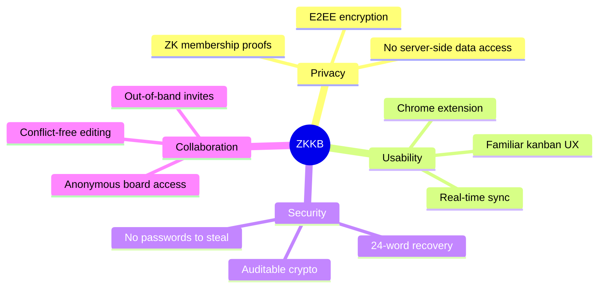

### 2.3 Competitive Analysis

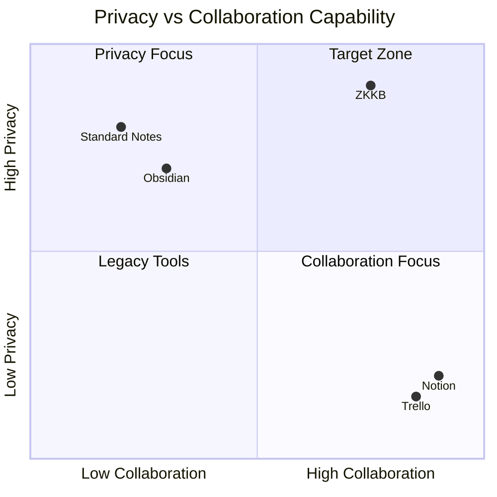

---

## 3. User Stories

### 3.1 Free Tier User Stories

| ID | As a... | I want to... | So that... | Priority |
|----|---------|--------------|------------|----------|
| F1 | New user | Create a local board without signup | I can try the product immediately | P0 |
| F2 | User | Generate a recovery phrase | I can recover my data on any device | P0 |
| F3 | User | Create, edit, and delete cards | I can manage my tasks | P0 |
| F4 | User | Organize cards into columns | I can visualize workflow | P0 |
| F5 | User | Add labels to cards | I can categorize tasks | P1 |
| F6 | User | Set due dates | I can track deadlines | P1 |
| F7 | User | Export my boards | I have a backup | P2 |

### 3.2 Pro Tier User Stories

| ID | As a... | I want to... | So that... | Priority |
|----|---------|--------------|------------|----------|
| P1 | Team member | Access boards from multiple devices | I can work anywhere | P0 |
| P2 | Board owner | Invite others via secure link | We can collaborate | P0 |
| P3 | Collaborator | See others' changes in real-time | We stay in sync | P0 |
| P4 | User | Attach files to cards | I can share documents | P1 |
| P5 | User | Add comments to cards | We can discuss tasks | P1 |
| P6 | Board owner | Remove members | I control access | P1 |

---

## 4. Functional Requirements

### 4.1 Authentication & Identity

ZKKB uses a **decoupled identity model** where email authentication and board operations are completely separate.

#### 4.1.1 Signup Flow

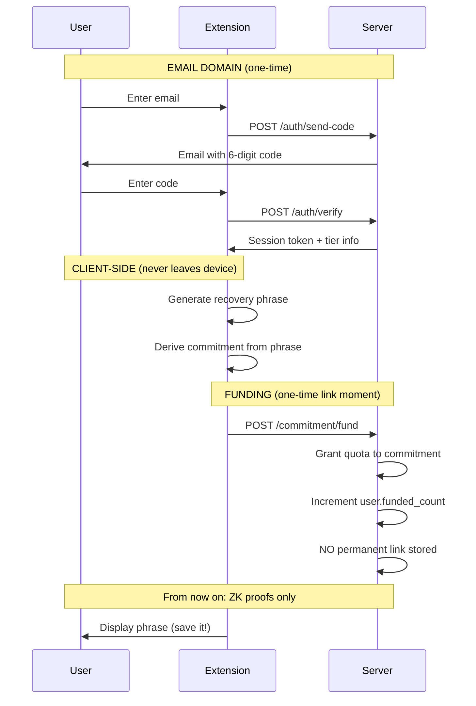

#### 4.1.2 Board Operations (Post-Signup)

All board operations use ZK proofs — **email/session never involved**:

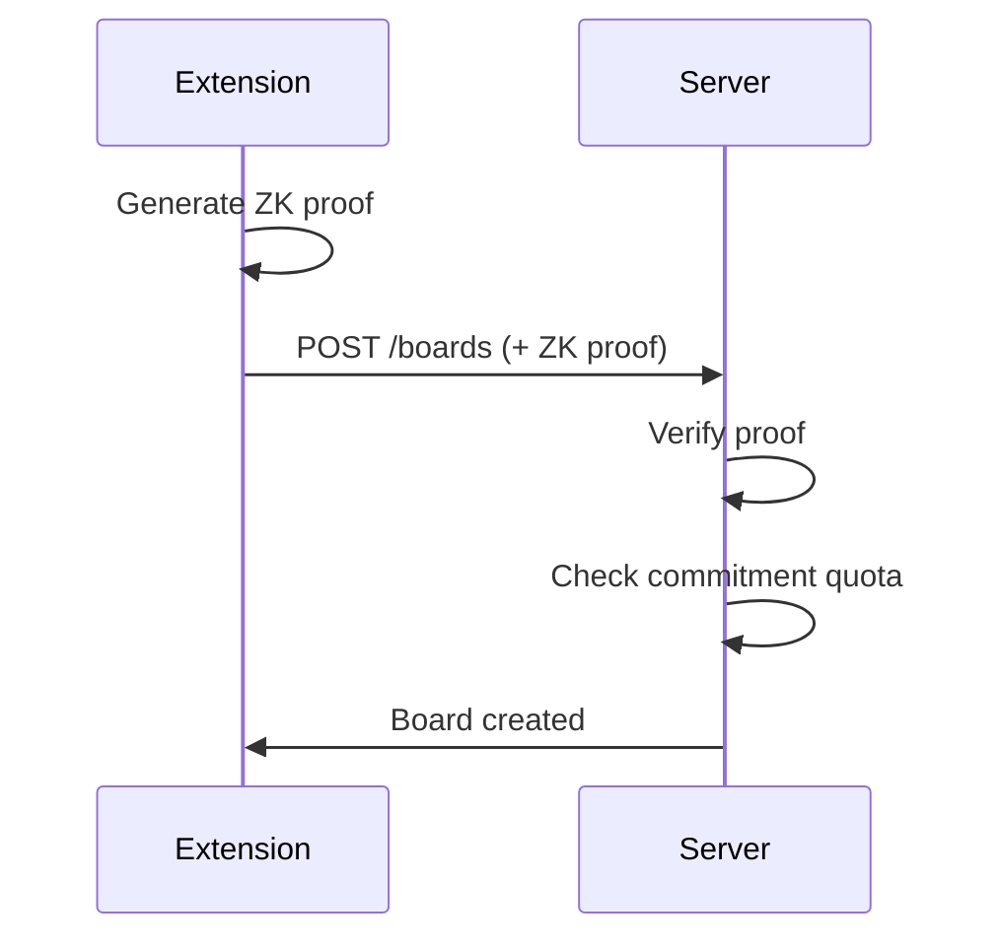

**Requirements**:
- FR-AUTH-1: Magic link authentication via email (for billing only)
- FR-AUTH-2: 6-digit verification code with 5-minute expiry
- FR-AUTH-3: Rate limiting: 3 attempts per email per hour
- FR-AUTH-4: BIP39 24-word recovery phrase generation
- FR-AUTH-5: Key derivation from phrase (deterministic)
- FR-AUTH-6: One-time commitment funding with no permanent email link
- FR-AUTH-7: All board operations use ZK proofs, never session tokens

### 4.2 Board Management

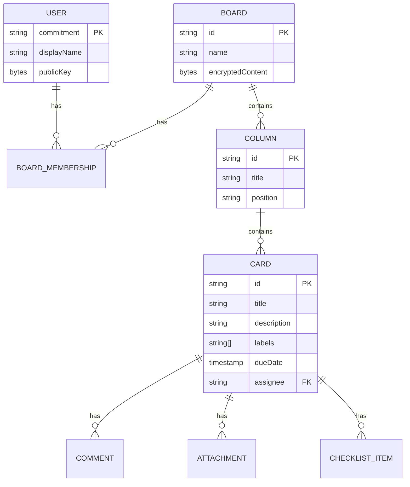

**Requirements**:
- FR-BOARD-1: Create new board with default columns (To Do, In Progress, Done)
- FR-BOARD-2: Rename boards
- FR-BOARD-3: Archive boards (soft delete)
- FR-BOARD-4: Add/rename/reorder columns
- FR-BOARD-5: Drag-and-drop card reordering

### 4.3 Encryption

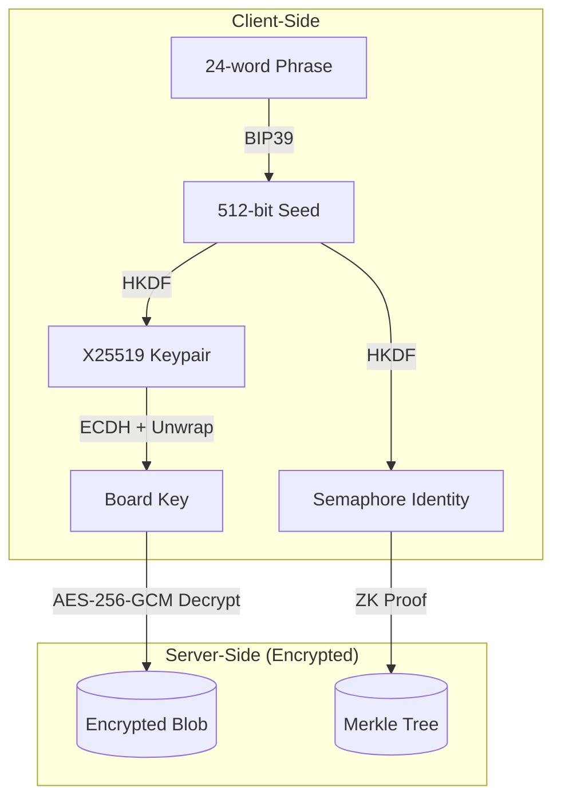

**Requirements**:
- FR-CRYPTO-1: AES-256-GCM for all board content encryption
- FR-CRYPTO-2: X25519 for key exchange/wrapping
- FR-CRYPTO-3: Per-board random encryption keys
- FR-CRYPTO-4: Per-attachment random encryption keys
- FR-CRYPTO-5: 12-byte random IV for each encryption operation

### 4.4 Collaboration (Pro)

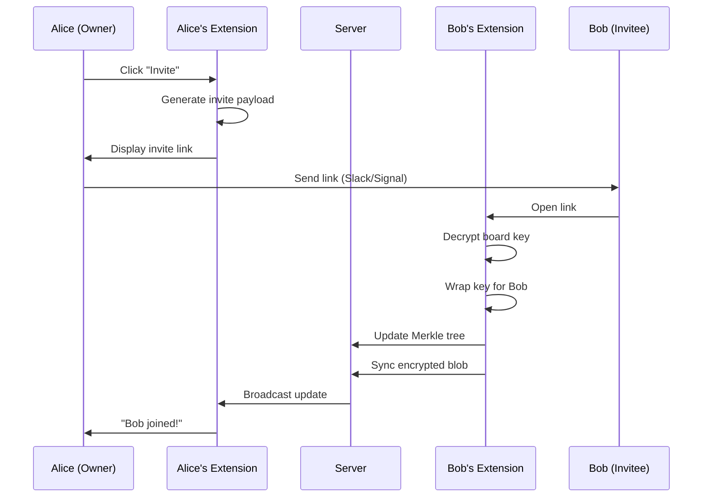

**Requirements**:
- FR-COLLAB-1: Out-of-band invite links (no server knowledge of inviter/invitee)
- FR-COLLAB-2: Merkle tree membership verification
- FR-COLLAB-3: ZK proof for sync operations (server cannot attribute edits to specific members)
- FR-COLLAB-4: Real-time sync via WebSocket
- FR-COLLAB-5: Automerge CRDT for conflict resolution

### 4.5 Sync Architecture

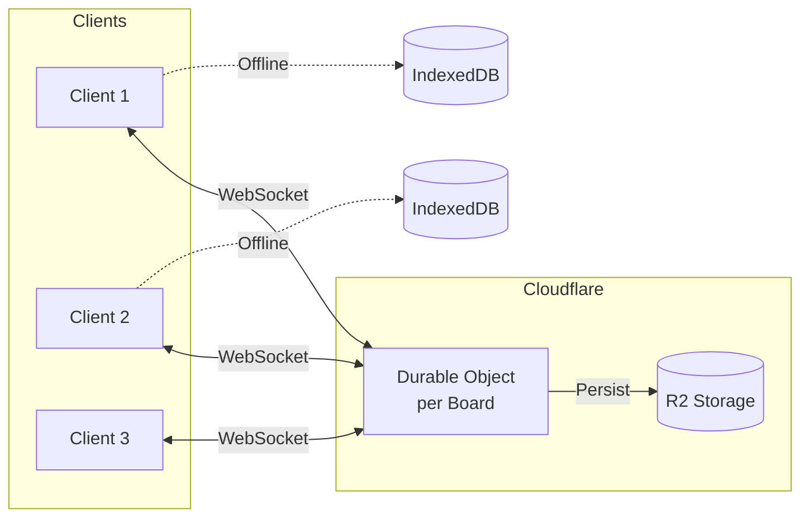

**Requirements**:
- FR-SYNC-1: Encrypted Automerge sync messages over WebSocket
- FR-SYNC-2: Offline editing with local persistence
- FR-SYNC-3: Automatic reconnection with exponential backoff
- FR-SYNC-4: Conflict-free merge on reconnection

---

## 5. Non-Functional Requirements

### 5.1 Performance

| Metric | Requirement |
|--------|-------------|
| Board load time | < 2 seconds (cached), < 5 seconds (cold) |
| Sync latency | < 500ms for edits to appear on other clients |
| Extension memory | < 100MB |
| Build size | < 2MB total |

### 5.2 Security

| Requirement | Description |
|-------------|-------------|
| NFR-SEC-1 | All network traffic over HTTPS/WSS |
| NFR-SEC-2 | No plaintext data transmitted or stored server-side |
| NFR-SEC-3 | CSP headers preventing XSS |
| NFR-SEC-4 | Rate limiting on all API endpoints |
| NFR-SEC-5 | Audit logging for security events |

### 5.3 Reliability

| Metric | Target |
|--------|--------|
| Uptime | 99.9% |
| Data durability | 99.999999999% (R2) |
| Recovery time | < 5 minutes |

### 5.4 Scalability

| Dimension | Initial | Target |
|-----------|---------|--------|
| Concurrent users per board | 10 | 50 |
| Boards per user | 100 | Unlimited |
| Cards per board | 1,000 | 10,000 |
| Attachment size | 25MB | 100MB |

---

## 6. Technical Architecture

### 6.1 System Components

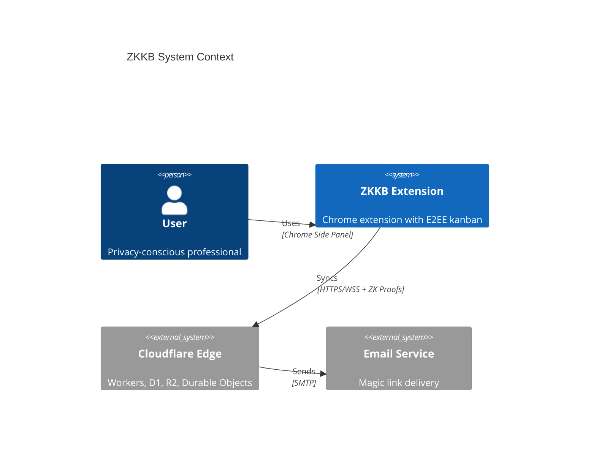

### 6.2 Data Flow

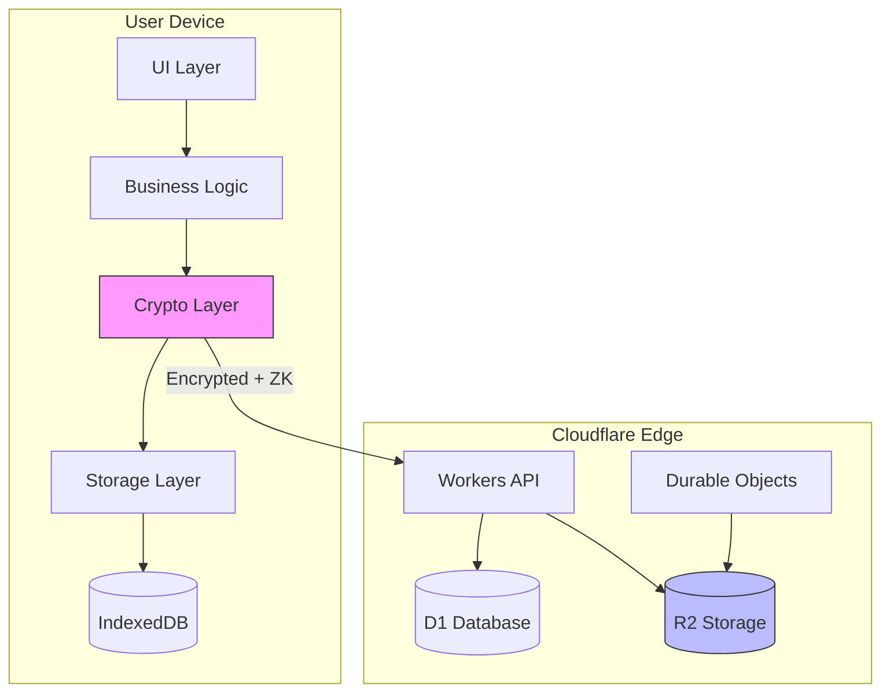

### 6.3 API Endpoints

#### Email Domain (Billing)

| Method | Path | Auth | Description |
|--------|------|------|-------------|
| POST | `/auth/send-code` | None | Request magic link |
| POST | `/auth/verify` | None | Verify code, get session |
| POST | `/auth/logout` | Session | Invalidate session |
| POST | `/commitment/fund` | Session | Fund commitment with quota (one-time) |

#### Commitment Domain (Boards)

| Method | Path | Auth | Description |
|--------|------|------|-------------|
| POST | `/boards` | ZK Proof | Create board |
| GET | `/boards/:id/tree` | ZK Proof | Get Merkle tree |
| PUT | `/boards/:id/tree` | ZK Proof | Update Merkle tree |
| GET | `/boards/:id/data` | ZK Proof | Get encrypted blob |
| PUT | `/boards/:id/data` | ZK Proof | Update encrypted blob |
| POST | `/boards/:id/upgrade` | ZK Proof | Upgrade board tier |
| GET | `/boards/:id/sync` | ZK Proof | WebSocket upgrade |
| GET | `/commitment/data` | ZK Proof | Get encrypted board list |
| PUT | `/commitment/data` | ZK Proof | Update encrypted board list |
| POST | `/attachments/upload-url` | ZK Proof | Get presigned upload URL |
| GET | `/attachments/:key` | ZK Proof | Get presigned download URL |
| DELETE | `/attachments/:key` | ZK Proof | Delete attachment |

**Note**: No `GET /boards` endpoint — board list is client-managed via encrypted `commitment/data`.

---

## 7. Security Model

### 7.1 Threat Model

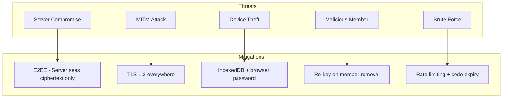

### 7.2 Data Classification

| Data Type | Classification | Protection |
|-----------|---------------|------------|
| Board content | Confidential | AES-256-GCM encrypted |
| Recovery phrase | Secret | Never transmitted, user custody |
| Private keys | Secret | IndexedDB, never transmitted |
| Email addresses | PII | D1, not linked to boards |
| Merkle trees | Internal | Public commitments only |

### 7.3 Server Knowledge Matrix (Decoupled Architecture)

#### Email Domain

| Data | Server Knows | Server Cannot Know |
|------|--------------|-------------------|
| Email address | ✅ Yes | — |
| Tier (free/pro) | ✅ Yes | — |
| Funded commitment count | ✅ Yes (e.g., "1") | Which commitment |
| Payment info | ✅ Yes | — |

#### Commitment Domain

| Data | Server Knows | Server Cannot Know |
|------|--------------|-------------------|
| Board exists | ✅ Yes (board ID) | Board name, content |
| Creator | ✅ Commitment | Whose commitment |
| Members | ✅ Merkle tree | Who they are |
| Activity | ✅ That sync happened | Which member |
| Board count | ✅ Per commitment | Whose commitment |
| Storage used | ✅ Per commitment | Whose commitment |

#### The Privacy Guarantee

```
┌─────────────────────────────────────────────────────────────────┐
│  Server sees TWO separate facts:                                │
│                                                                  │
│  1. "alice@example.com is a Pro customer"                       │
│  2. "Commitment 0x1a2b owns 3 boards"                           │
│                                                                  │
│  Server CANNOT link these facts.                                │
│  Only the client knows: alice's commitment is 0x1a2b            │
└─────────────────────────────────────────────────────────────────┘
```

**True Chatham House**: We know you're a paying customer. We cannot know which rooms you're in.

---

## 8. User Interface

### 8.1 Information Architecture

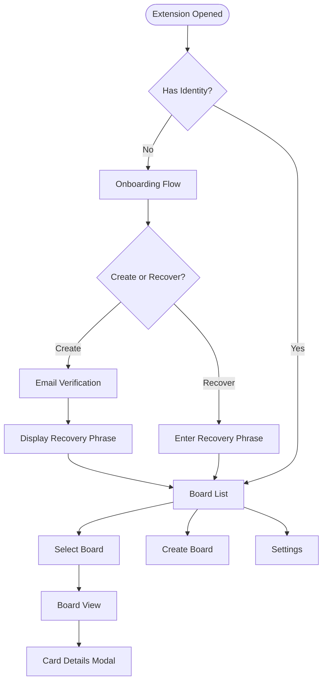

### 8.2 Key Screens

| Screen | Purpose | Key Elements |
|--------|---------|--------------|
| Onboarding | First-time setup | Email input, code verification, phrase display |
| Board List | Navigation | Board cards, create button, settings |
| Board View | Main workspace | Columns, cards, drag-drop |
| Card Modal | Task details | Title, description, labels, due date, comments |
| Invite Flow | Add members | Generate link, copy button |
| Settings | Configuration | Theme, export, delete account |

---

## 9. Release Plan

### 9.1 MVP (Phase 1)

**Timeline**: 2 weeks

**Scope**:
- Local-only boards (no sync)
- Core kanban features
- Recovery phrase generation
- Chrome extension (side panel)

### 9.2 Sync Release (Phase 2)

**Timeline**: 2 weeks after MVP

**Scope**:
- Cloud sync
- Real-time collaboration
- Board sharing

### 9.3 Polish Release (Phase 3)

**Timeline**: 2 weeks after Phase 2

**Scope**:
- Attachments
- Comments
- Export/import
- Settings

---

## 10. Appendix

### 10.1 Glossary

| Term | Definition |
|------|------------|
| E2EE | End-to-end encryption |
| ZK Proof | Zero-knowledge proof of membership |
| Commitment | Public identifier derived from private key, unlinkable to email |
| Merkle Tree | Data structure for efficient membership proofs |
| CRDT | Conflict-free Replicated Data Type |
| BIP39 | Bitcoin Improvement Proposal for mnemonic phrases |
| Decoupled Identity | Architecture where email (billing) and commitment (boards) are unlinkable |
| Chatham House Model | Privacy model where server knows you exist but not what you do |
| Funding | One-time operation granting quota to commitment without permanent link |

### 10.2 Architecture Decision Records

| ADR | Title | Status |
|-----|-------|--------|
| [ADR-001](adr/001-e2ee-recovery-phrase.md) | E2EE with BIP39 Recovery Phrase | Accepted |
| [ADR-002](adr/002-semaphore-zk-proofs.md) | Semaphore ZK Proofs for Anonymous Activity | Accepted |
| [ADR-003](adr/003-automerge-crdt.md) | Automerge CRDT for Collaboration | Accepted |
| [ADR-004](adr/004-cloudflare-infrastructure.md) | Cloudflare Infrastructure | Accepted |
| [ADR-005](adr/005-dual-licensing.md) | Dual Licensing Model | Accepted |
| [ADR-006](adr/006-decoupled-identity-architecture.md) | Decoupled Identity Architecture | Accepted |

### 10.3 External References

- [Semaphore Protocol](https://semaphore.pse.dev/)
- [Automerge CRDT](https://automerge.org/)
- [BIP39 Specification](https://github.com/bitcoin/bips/blob/master/bip-0039.mediawiki)
- [Cloudflare Workers](https://developers.cloudflare.com/workers/)
- [Chatham House Rule](https://www.chathamhouse.org/about-us/chatham-house-rule)
