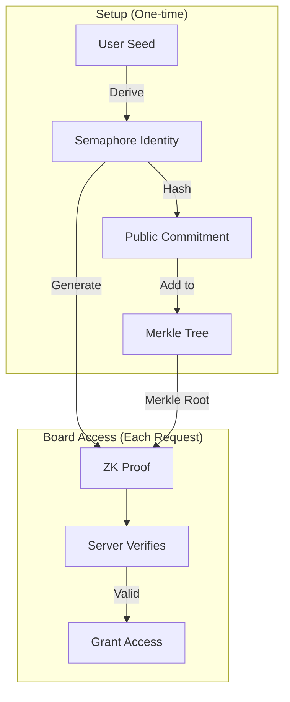
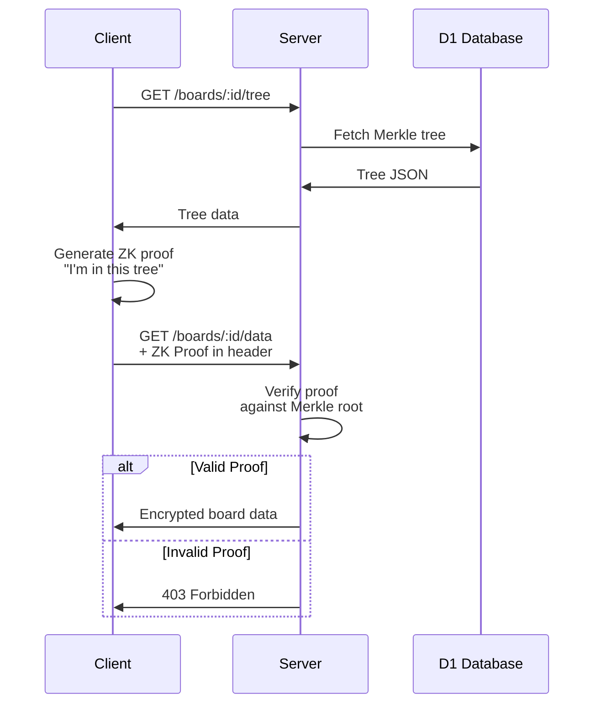
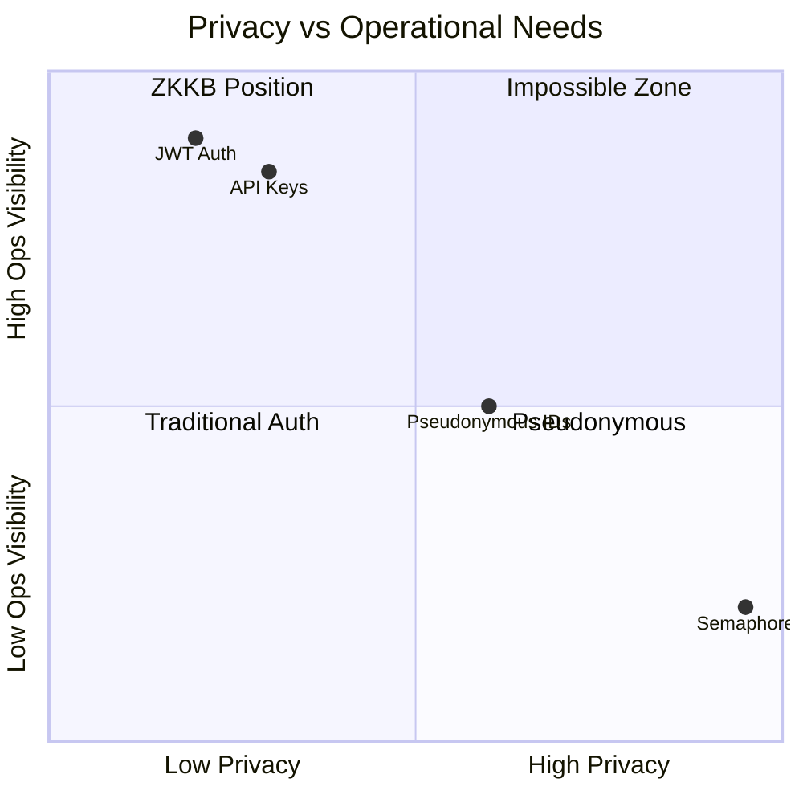

# ADR-002: Semaphore ZK Proofs for Anonymous Activity

## Status

Accepted

## Context

ZKKB needs to allow board members to sync changes without the server knowing *which* member made *which* edit. This provides **activity anonymity** within a group.

**What ZK proofs provide:**
- Server cannot attribute specific edits to specific members
- Server cannot build per-user activity timelines
- Server cannot correlate "User X edited card Y at time Z"

**What ZK proofs do NOT provide (on their own):**
- Membership anonymity — requires decoupled identity architecture
- Email privacy — requires separating email from board operations

> **Note**: With [ADR-006](006-decoupled-identity-architecture.md), we achieve BOTH activity AND membership anonymity by separating email (billing) from commitment (boards).

Traditional approaches don't provide activity anonymity:

| Approach | Server Knows |
|----------|--------------|
| JWT tokens | Exact user identity |
| API keys | Which key accessed what |
| Session cookies | User + timestamps |
| IP tracking | Location + patterns |

We need **anonymous activity**: prove membership for sync operations without revealing *which* member is syncing.

## Decision

We will use **Semaphore Protocol** for zero-knowledge membership proofs.



### How Semaphore Works

1. **Identity**: User has trapdoor + nullifier (private), commitment (public)
2. **Group**: Merkle tree of all member commitments
3. **Proof**: ZK proof that "I know a secret whose commitment is in this tree"
4. **Verification**: Server checks proof against Merkle root, never sees identity

### Data Structures

```typescript
// Server stores (D1)
interface Board {
  id: string;
  merkle_root: string;       // Current tree root
  merkle_tree_json: string;  // Full tree for proof generation
}

// Client generates
interface AccessProof {
  merkleTreeRoot: bigint;
  nullifierHash: bigint;
  signal: string;
  proof: Proof;
}
```

### Authentication Flow



### Nullifier Strategy

Each proof includes a nullifier hash to prevent replay attacks:
- Nullifier = `hash(identity.nullifier, scope)`
- Scope = `board_${boardId}_${action}`
- Server can reject duplicate nullifiers within time window

## Consequences

### Positive

- **Activity anonymity**: Server cannot attribute edits to specific members
- **Efficient verification**: ~10ms server-side
- **Standard protocol**: Audited cryptography
- **Scalable**: O(log n) proof size regardless of group size

### Negative

- **Proof generation time**: 2-5 seconds on client (WASM)
- **Bundle size**: ~2MB for Semaphore WASM
- **Complexity**: ZK concepts unfamiliar to most developers
- **No activity audit**: Can't determine "who edited what" (by design)

### Privacy Matrix (with ADR-006 Decoupled Architecture)

With the decoupled identity architecture, ZK proofs provide full anonymity:

| Aspect | Anonymous? | How |
|--------|------------|-----|
| Board membership | ✅ Yes | No `user_boards` table; commitment ≠ email |
| Email address | ✅ Yes | Email used for billing only, not board ops |
| Which member synced | ✅ Yes | ZK proof only proves "valid member" |
| Which member edited what | ✅ Yes | Edits in encrypted blob, sync is anonymous |

**Without ADR-006**, only activity would be anonymous (server would know membership via `user_boards`).

**With ADR-006**, both membership AND activity are anonymous — true Chatham House model.

### Tradeoffs



### Mitigations

1. **Proof caching**: Cache proof for 5 minutes to reduce generation overhead
2. **Lazy loading**: Load Semaphore WASM only when needed
3. **Progress UI**: Show "Generating secure proof..." during wait
4. **Fallback**: Graceful degradation if proof fails

## Implementation Details

### Semaphore Version

Using Semaphore v4:
- Groth16 proofs
- Poseidon hash for Merkle tree
- 20-level tree depth (1M members max)

### Key Derivation

```typescript
import { Identity } from '@semaphore-protocol/identity'
import { hkdf } from '@noble/hashes/hkdf'
import { sha256 } from '@noble/hashes/sha256'

function identityFromSeed(seed: Uint8Array): Identity {
  const secret = hkdf(sha256, seed.slice(0, 32), undefined, 'semaphore-identity', 32)
  return new Identity(secret)
}
```

### Proof Generation

```typescript
import { generateProof } from '@semaphore-protocol/proof'

const proof = await generateProof(
  identity,
  group,
  message,    // e.g., "read"
  scope       // e.g., "board_abc123"
)
```

### Server Verification

```typescript
import { verifyProof } from '@semaphore-protocol/proof'

async function verifyAccess(proof: SemaphoreProof, expectedRoot: bigint) {
  if (proof.merkleTreeRoot !== expectedRoot) {
    return false
  }
  return verifyProof(proof)
}
```

## Alternatives Considered

### Ring Signatures

Rejected because:
- Proof size grows with group size
- Less mature tooling
- No nullifier mechanism

### Trusted Execution Environments (TEE)

Rejected because:
- Requires specific hardware
- Trust in TEE manufacturer
- Complex deployment

### Homomorphic Encryption

Rejected because:
- Extremely slow
- Overkill for membership proofs
- Immature browser support

## Related ADRs

- [ADR-001: E2EE with BIP39](001-e2ee-recovery-phrase.md) — Key derivation for ZK identity
- [ADR-006: Decoupled Identity](006-decoupled-identity-architecture.md) — Enables membership anonymity

## References

- [Semaphore Protocol](https://semaphore.pse.dev/)
- [Semaphore v4 Docs](https://docs.semaphore.pse.dev/)
- [Privacy & Scaling Explorations](https://pse.dev/)
- [Groth16 Paper](https://eprint.iacr.org/2016/260)
