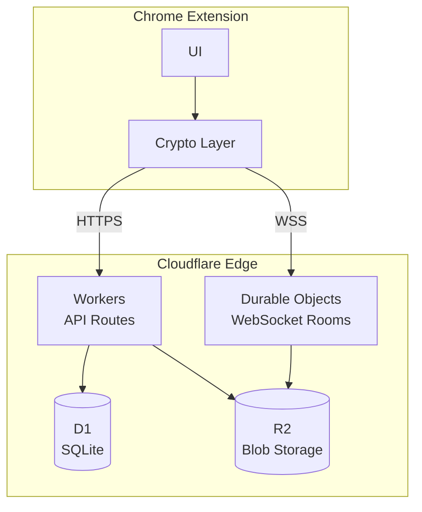
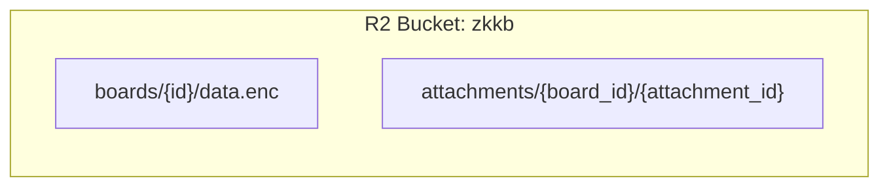
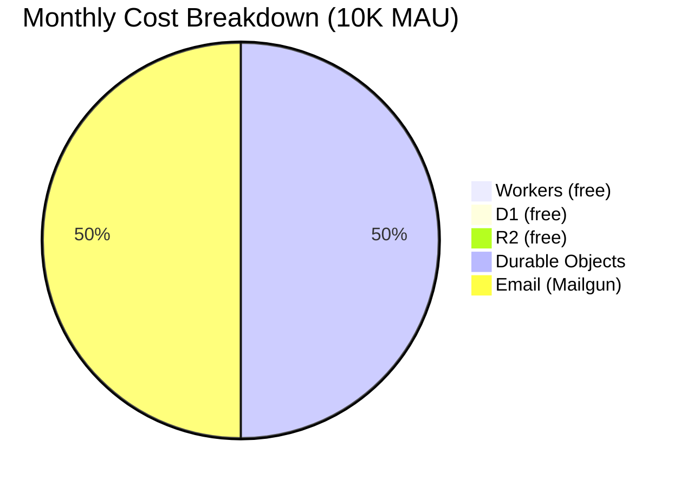

# ADR-004: Cloudflare Workers Infrastructure

## Status

Accepted

## Context

ZKKB needs backend infrastructure for:
- Authentication (magic links)
- Merkle tree storage
- Encrypted blob storage
- Real-time WebSocket sync

Requirements:
- Edge deployment (low latency globally)
- Cost-effective for small scale
- Scales without re-architecture
- Simple deployment (no Kubernetes)

## Decision

We will use **Cloudflare's serverless platform** for all backend services.



### Service Selection

| Need | Cloudflare Service | Alternative Considered |
|------|-------------------|----------------------|
| API endpoints | Workers | AWS Lambda, Vercel |
| Database | D1 | PlanetScale, Supabase |
| Blob storage | R2 | S3, Backblaze B2 |
| WebSockets | Durable Objects | Pusher, Ably |

### Why Cloudflare

1. **Unified platform**: One vendor, one deployment system
2. **Edge-first**: Code runs in 300+ locations
3. **Generous free tier**: Most services have substantial free usage
4. **Cost predictable**: D1 and R2 are extremely cheap
5. **Wrangler CLI**: Excellent developer experience

## Architecture

### Workers (API)

```typescript
// src/index.ts
export default {
  async fetch(request: Request, env: Env): Promise<Response> {
    const url = new URL(request.url)

    // Route matching
    if (url.pathname.startsWith('/auth/')) {
      return handleAuth(request, env)
    }
    if (url.pathname.startsWith('/boards/')) {
      return handleBoards(request, env)
    }
    // ...
  }
}
```

### D1 (SQLite Database)

The schema implements the **decoupled identity architecture** from [ADR-006](006-decoupled-identity-architecture.md), separating email (billing) from commitment (boards):

```sql
-- EMAIL DOMAIN: Billing only, no board references
CREATE TABLE users (
  id TEXT PRIMARY KEY,
  email TEXT UNIQUE NOT NULL,
  tier TEXT NOT NULL DEFAULT 'free',
  funded_commitment_count INTEGER NOT NULL DEFAULT 0,
  created_at INTEGER NOT NULL
);

-- COMMITMENT DOMAIN: Boards linked to commitments, not users
CREATE TABLE boards (
  id TEXT PRIMARY KEY,
  creator_commitment TEXT NOT NULL,  -- NOT user_id
  tier TEXT NOT NULL DEFAULT 'free',
  merkle_root TEXT NOT NULL,
  merkle_tree_json TEXT NOT NULL,
  member_count INTEGER NOT NULL DEFAULT 1,
  created_at INTEGER NOT NULL
);

-- Quota tracking per commitment (unlinkable to email)
CREATE TABLE commitment_quotas (
  commitment TEXT PRIMARY KEY,
  board_count INTEGER NOT NULL DEFAULT 0,
  storage_bytes INTEGER NOT NULL DEFAULT 0,
  storage_limit INTEGER NOT NULL,
  expires_at INTEGER
);

-- Encrypted board list per commitment
CREATE TABLE commitment_data (
  commitment TEXT PRIMARY KEY,
  encrypted_blob BLOB NOT NULL,
  updated_at INTEGER NOT NULL
);

-- Auth tables (email domain only)
CREATE TABLE magic_links (
  id TEXT PRIMARY KEY,
  email TEXT NOT NULL,
  code TEXT NOT NULL,
  expires_at INTEGER NOT NULL,
  used INTEGER DEFAULT 0
);

CREATE TABLE sessions (
  id TEXT PRIMARY KEY,
  user_id TEXT NOT NULL,
  expires_at INTEGER NOT NULL,
  FOREIGN KEY (user_id) REFERENCES users(id)
);
```

**Privacy guarantee**: No `user_boards` table. Server cannot link email to boards.

### R2 (Blob Storage)



- Boards stored as encrypted Automerge documents
- Attachments stored with per-file encryption
- Presigned URLs for direct upload/download

### Durable Objects (WebSocket Rooms)

```typescript
// src/durable-objects/BoardSync.ts
export class BoardSync implements DurableObject {
  private connections: Map<WebSocket, string> = new Map()
  private state: DurableObjectState

  constructor(state: DurableObjectState, env: Env) {
    this.state = state
  }

  async fetch(request: Request): Promise<Response> {
    if (request.headers.get('Upgrade') === 'websocket') {
      const pair = new WebSocketPair()
      await this.handleSession(pair[1])
      return new Response(null, { status: 101, webSocket: pair[0] })
    }
    return new Response('Expected WebSocket', { status: 400 })
  }

  async handleSession(ws: WebSocket) {
    ws.accept()
    this.connections.set(ws, crypto.randomUUID())

    ws.addEventListener('message', (msg) => {
      // Broadcast to all other connections
      for (const [conn] of this.connections) {
        if (conn !== ws && conn.readyState === WebSocket.OPEN) {
          conn.send(msg.data)
        }
      }
    })

    ws.addEventListener('close', () => {
      this.connections.delete(ws)
    })
  }
}
```

## Consequences

### Positive

- **Low latency**: Edge deployment globally
- **Zero ops**: No servers to manage
- **Cost effective**: Pay per use, generous free tiers
- **Simple deployment**: `wrangler deploy`
- **Automatic scaling**: Handles traffic spikes

### Negative

- **Durable Objects cost**: No free tier (~$5/month minimum)
- **Vendor lock-in**: Cloudflare-specific APIs
- **Cold starts**: First request to a DO may be slow
- **Limited debugging**: No traditional server access

### Cost Analysis



| Service | Free Tier | Expected Usage | Cost |
|---------|-----------|----------------|------|
| Workers | 100K req/day | 50K req/day | $0 |
| D1 | 5GB, 5M reads/day | 1GB, 500K reads | $0 |
| R2 | 10GB, 10M reads/mo | 5GB, 1M reads | $0 |
| Durable Objects | None | 1000 boards active | ~$5 |
| **Total** | | | **~$5/mo** |

### Scaling Path

| Scale | Architecture |
|-------|--------------|
| 0-10K users | Single Worker, D1, R2, DO |
| 10K-100K | Same, may need D1 replicas |
| 100K+ | Consider dedicated infrastructure |

## Implementation

### wrangler.toml

```toml
name = "zkkb-api"
main = "src/index.ts"
compatibility_date = "2024-01-01"

[[d1_databases]]
binding = "DB"
database_name = "zkkb"
database_id = "..." # From wrangler d1 create

[[r2_buckets]]
binding = "R2"
bucket_name = "zkkb"

[[durable_objects.bindings]]
name = "BOARD_SYNC"
class_name = "BoardSync"

[[migrations]]
tag = "v1"
new_classes = ["BoardSync"]
```

### Environment Types

```typescript
interface Env {
  DB: D1Database
  R2: R2Bucket
  BOARD_SYNC: DurableObjectNamespace
  EMAIL_API_KEY: string
}
```

## Alternatives Considered

### AWS (Lambda + DynamoDB + S3)

Rejected because:
- More complex setup
- Higher baseline cost
- No native WebSocket (needs API Gateway)
- More vendor services to manage

### Supabase

Rejected because:
- PostgreSQL is overkill
- Real-time requires their SDK
- Less edge presence
- Higher cost for our use case

### Self-hosted (VPS + PostgreSQL)

Rejected because:
- Ops overhead
- Single region latency
- Manual scaling
- Higher cost at low scale

### Fly.io

Considered viable, rejected because:
- Less integrated (no native blob storage)
- Would need separate R2/S3 anyway
- Cloudflare has better edge distribution

## Related ADRs

- [ADR-006: Decoupled Identity](006-decoupled-identity-architecture.md) — Schema design for privacy

## References

- [Cloudflare Workers](https://developers.cloudflare.com/workers/)
- [Cloudflare D1](https://developers.cloudflare.com/d1/)
- [Cloudflare R2](https://developers.cloudflare.com/r2/)
- [Durable Objects](https://developers.cloudflare.com/durable-objects/)
